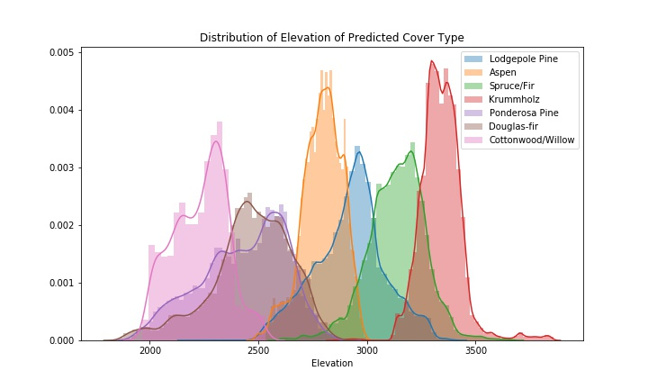

# Forest Cover Type Prediction
[Notebook.](Forest_cover_Type_prediction.ipynb)

Use cartographic variables to classify forest categories. Balanced Mulit-Class Classification problem.
    Exploratory Data Analysis performed to identify promising features, visualising data interactions. Feature selection to reduce the number of features from 54 to 12. Performed predictive modelling using tree based methods Random Forest and XGBoost. Kaggle accuracy of 76.4%.

   
